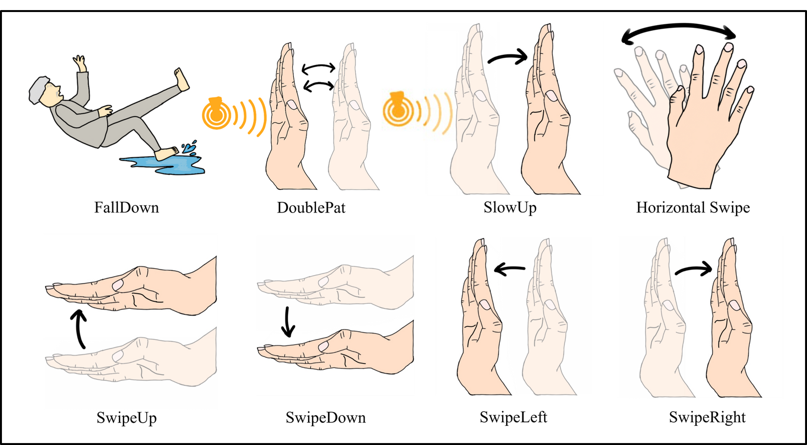

# LiteMMV-GCL

LiteMMV-GCL is a lightweight gesture recognition framework designed for privacy-sensitive environments. Unlike traditional systems that rely on visual sensors, LiteMMV-GCL leverages millimeter-wave (MMWave) radar data and transfer learning to achieve high accuracy with minimal training samples.

## Overview

AI systems in consumer electronics often rely on visual recognition, which raises privacy concerns in sensitive environments such as bathrooms. To address this, we propose **LiteMMV-GCL**, a lightweight gesture recognition framework based on millimeter-wave (MMWave) sensing and enhanced through transfer learning.

Our experiments show that the **two-stage training approach** significantly improves recognition accuracy and convergence speed, even with limited training data. Remarkably, the system achieves strong performance with as few as **12 samples per category**, demonstrating robustness in data-scarce conditions.